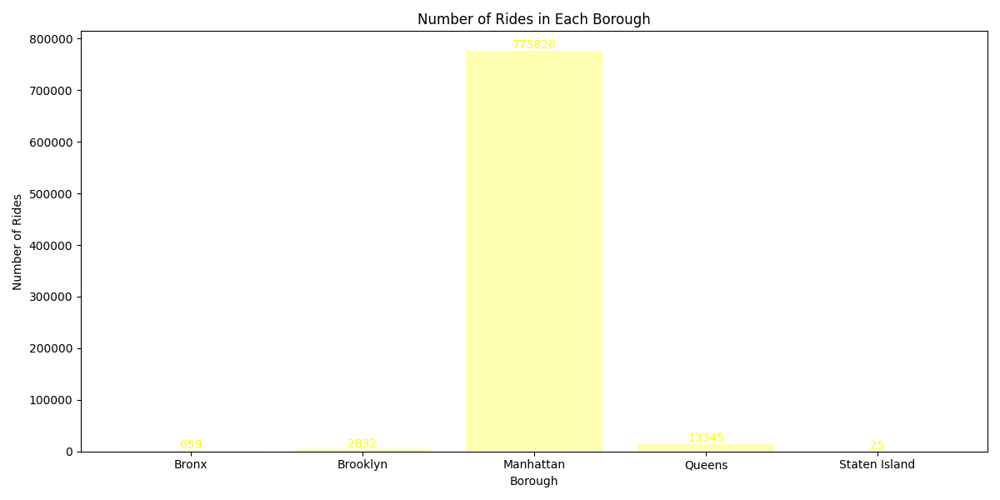
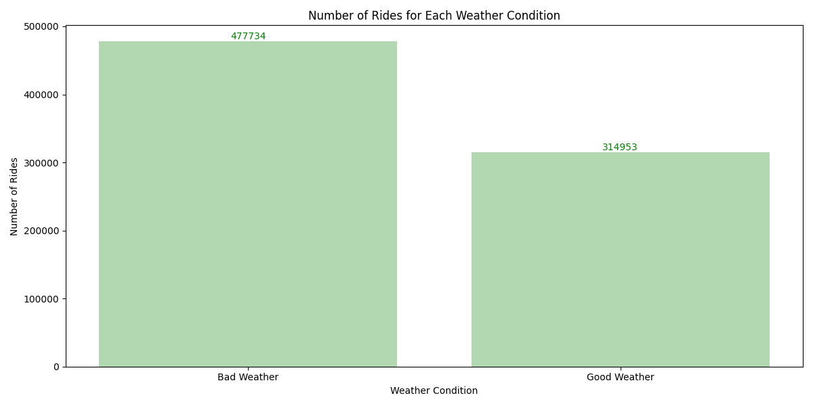
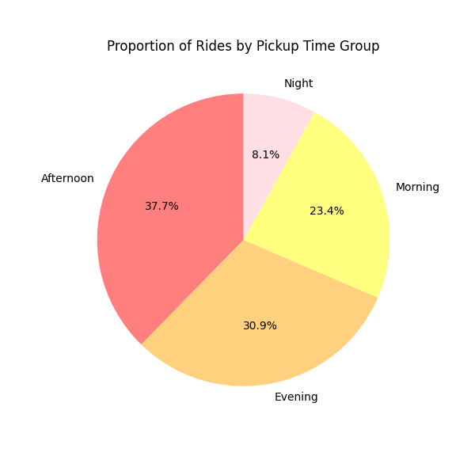
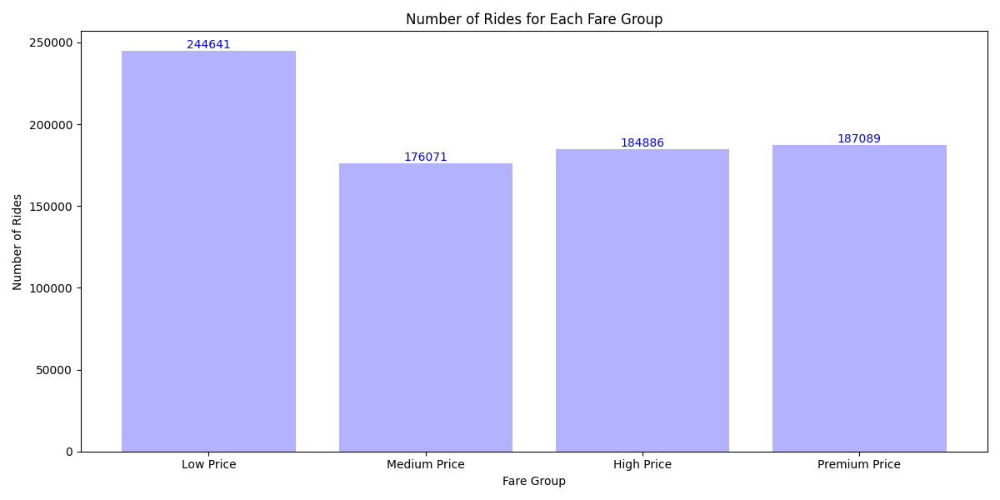
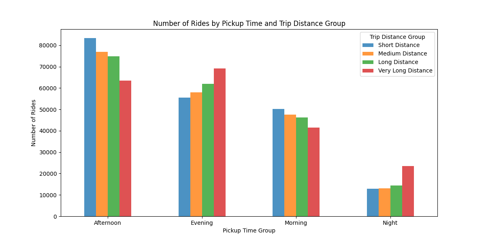
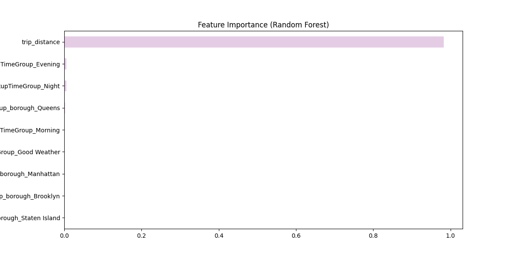
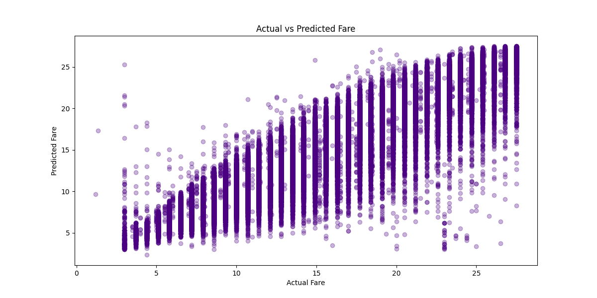
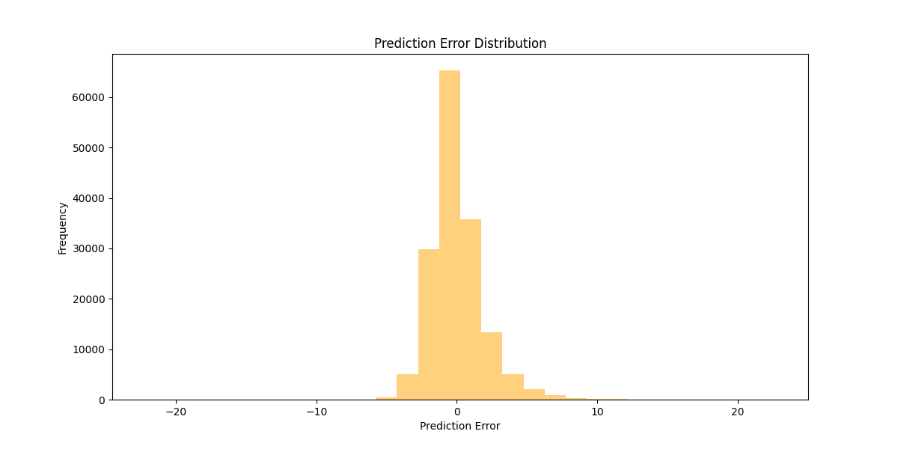

# Taxi Ride Data Analysis Project

## Overview
This project analyzes taxi ride data to extract behavioral patterns and predict fare amounts using data mining and machine learning techniques. 
It combines Association Rule Mining (Market Basket Analysis) and Random Forest Regression to determine relationships between trip conditions and fare pricing.

---

## Tools & Technologies
- Python
- Pandas
- NumPy
- Matplotlib
- Scikit-learn

---

## Project Workflow

### 1. Data Understanding
- Exploratory analysis of ride dataset
- Identification of key variables affecting fare pricing

### 2. Data Preparation
- Handling missing values
- Feature engineering (e.g., weather condition, time of day, and fare categories)
- Encoding categorical variables using one-hot encoding

### 3. Association Rule Mining
- Applied Market Basket Analysis on trip attributes
- Generated rules using support, confidence, and lift
- Identified relationships between weather, time, and fare conditions

### 4. Predictive Modeling
- Built a Random Forest Regressor
- Predicted fare amount based on trip distance, time, weather, and location
- Evaluated model using MAE and RMSE

---

## Key Insights
- Trip distance is the most significant factor influencing fare amount.
- Time of day and location have minor influence on fare variation.
- Weather conditions show weak but detectable impact on pricing patterns.
- The Random Forest model achieved good predictive accuracy with low error rates.

---

## Model Performance
- MAE: ~1.37
- RMSE: ~1.91

---

## 📊 Exploratory Data Analysis (EDA) Visualizations
The following visualizations were created using Python's Matplotlib library to explore ride patterns and fare behavior.

---

### Ride Distribution by Borough

---

### Number of Ride by Weather Condition

---

### Proportion of Rides by Pickup Time Group

---

### Number of Rides for Each Fare Group

---

### Number of Rides by Pickup Time and Trip Distance Group

---

### Feature Importance (Random Forest)

---

### Actual vs Predicted Fare

---

### Prediction Error Distribution

---

## Conclusion
The analysis shows that fare pricing is primarily driven by trip distance, while other factors contribute marginally. 
The combination of association rule mining and predictive modeling provides both descriptive and predictive insights into taxi ride behavior.